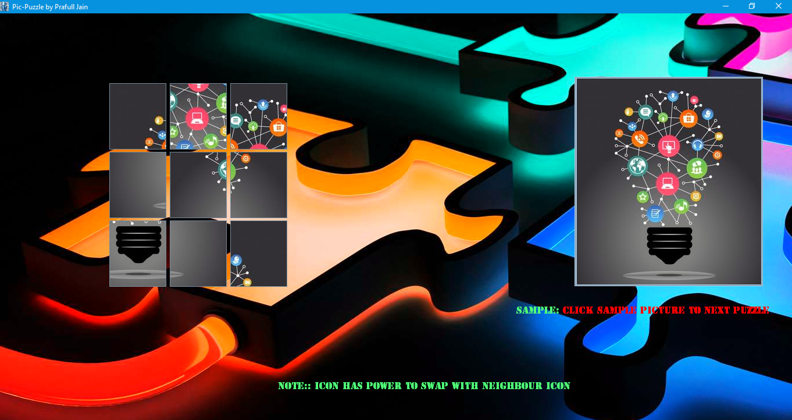

<!Doctype html>
<head>
<meta charset="UTF-8"></meta>
</head>
<body style="color:white;background-color:black;">
	
<h1><u>Java-Application World</u></h1>

	
<u></u>

	

	<section style="margin:5px 50px 0px 50px;padding:10px;background-color:lightgrey;color:black;
	border: 5px groove yellowgreen;border-radius: 39px 0px 35px 0px;">
		<h2><li>Rules & Instructions :-</li></h2>
			<ol>
				<li>GUI-Calculator :-
					<article style="margin-left:42px;margin-right:42px;margin-top: 8px;">
							This Application is basic calculator that is used to perform mathematical 
							operation and also for bigger value but it uses java specific symbol 'E' 
							(Exponential).You can see the links to understand Exponential value.  
							<a href='https://introcs.cs.princeton.edu/java/91float/Exponential.java.html'>
								Exponential.java</a> 
							<a href='https://www.viralpatel.net/java-convert-exponential-decimal-double-number/'>
								Convert Exponential form to Decimal number format in Java</a> 
							<a href='https://en.wikipedia.org/wiki/Scientific_notation#E_notation'>
								E notation</a> 
							<a href='https://www.janbasktraining.com/blog/what-is-java-exponent/'>
								what-is-java-exponent</a>  
							

					</article>
				</li>
				  
				<li>Text-Editor:-
					<article style="margin-left:42px;margin-right:42px;margin-top: 8px;">
						This Application is doing notepad like things with Time-Date,Undo,Redo,ColorChooser 
						API (JAR) Files	Features. You can also change look & feel of text-window. This is also
						based on all the Java Provided LookFeel Themes.You can see the links to understand 
						Different Look & Feel very well.  
						<a href='https://www.geeksforgeeks.org/java-swing-look-feel/'>
							Java Swing | Look and Feel</a> 
						<a href='https://docs.oracle.com/javase/tutorial/uiswing/lookandfeel/index.html'>
							Modifying the Look and Feel-Oracle</a> 
						<a href='https://docs.oracle.com/javase/tutorial/uiswing/lookandfeel/plaf.html'>
							How to Set the Look and Feel-Oracle</a>  
						

						
						
<b><u>Limitations:-</b></u>
							<article style="margin-left:42px;margin-right:42px;margin-top: 8px;">
								This Application is not bug free it means there are some errors or Features
									that does not work currently.I was listed down all the un-compatible Features  
									1)Font Selector:-I applied the JAR file but it is not take correct path.  
									2)Title/Label of Text-File:-This label is sometimes doesn't show after you save the file.
							</article>
						

					</article>
				</li>
				 
				<li>IP-Finder:-
					<article style="margin-left:42px;margin-right:42px;margin-top: 8px;">
						This Application is used to Find the IP-Address Port Number of any Websites/blog.
						It uses Java INet API to get the Network Address during Runtime.There some resource 
						below in which you will able to understand the JAVA Inet-API.  
						<a href='https://www.javatpoint.com/java-net-package'>
							java.net-Javatpoint</a> 
						<a href='https://docs.oracle.com/javase/7/docs/api/java/net/package-summary.html'>
							Package java.net-Oracle</a>   
						

						
<b><u>Instructions:-</b></u>
							<article style="margin-left:42px;margin-right:42px;margin-top: 8px;">
								1)Please make sure that you have proper internet connection.(There is not any Error Messaging Technique Used).  
									2)Enter the URL of any website in given White text-field area but only in given format i.e <b>'www.xyz@domain.com'</b>.   
							</article>
						

					</article>
				</li>	
				 
				<li>Source-Code Generator:-
					<article style="margin-left:42px;margin-right:42px;margin-top: 8px;">
						This Application is used to get the Source-Code of any Website like HTML/CSS/Javascript.
						It also uses Java internet API with URL Class to get the All the Source-Code during Runtime.  
						

					</article>
				</li>
				 
				<li>Client-Server Chat Application:-
					<article style="margin-left:42px;margin-right:42px;margin-top: 8px;">
						This Application is used to provide the mechanism of chatting over different network.
						It uses Java MultiThreading Concept to Open Client-Server window on same time and if any of them is closed then another window either it is Client/Server automatically closed.
						There some resource below in which you will able to understand the JAVA MultiThreading Concept.  
						<a href='https://www.javatpoint.com/multithreading-in-java'>
							Multithreading in Java-Javatpoint</a> 
						<a href='https://www.geeksforgeeks.org/runnable-interface-in-java/'>
							Runnable interface in Java-GeeksForGeeks</a> 
						<a href="https://www.geeksforgeeks.org/multithreading-in-java/">
							Multithreading in Java-GeeksForGeeks</a>   
							

						
<b><u>Instructions/Limitations:-</b></u>
							<article style="margin-left:42px;margin-right:42px;margin-top: 8px;">
								1)Please make sure that you have not connected any WIFI/Router Or any other network connection 
										because this application uses some ip-address that conflict when u send some message.  
									2)Firstly Client is the person who send message.   
									3)This application is also depends on your Operation System/Desktop/PC Resources.

							</article>
						

					</article>
				</li>
				 
				<li>Number-Puzzle Game:-
					<article style="margin-left:42px;margin-right:42px;margin-top: 8px;">
						This Game is based on Number and you have to arrange it in ascending order like (1,2,3,4..).
						It consist of 2 game sets,you can change it through clicking on 'Next' button.  
						

					</article>
				</li>
				 
				<li>Picture/Pic-Puzzle Game:-
					<article style="margin-left:42px;margin-right:42px;margin-top: 8px;">
						This Game is based on Picture and you have to arrange it in given original picture.
						It consist of 3 images you can change it through clicking on them.  
						

  
						

  
						

 
					</article>
				</li>
				 
				<li>Brick-Breaker Game:-
					<article style="margin-left:42px;margin-right:42px;margin-top: 8px;">
						This Game is feels like classic breakout brick game.  
						

						
<b><u>Instructions/Limitations:-</b></u>
							<article style="margin-left:42px;margin-right:42px;margin-top: 8px;">
								1)First Time It Loads slowly because of low resources from operating system.  
									2)When you close this game and restart immediately then it doesn't work.
										It takes time i.e 1-2 minute for restarting the game.  
									3) It is only limited to single level not any further development.
							</article>
						

					</article>
				</li>
			</ol>
		<h3>Extras :-
			<ol>
				<li>It is only used for PC/Desktop not for Web/Mobile.</li> 
				<li>If u have any problem/suggestions/errors then just e-mail me on below email-address.
					 <a href='mailto:prafulljaincp@gmail.com'>prafulljaincp@gmail.com</a>
						,<a href='mailto:2016csprafull4817@poornima.edu.in'>2016csprafull4817@poornima.edu.in</a>
				</li>
			</ol>
		</h3>
	</section>
</body>
</html>
